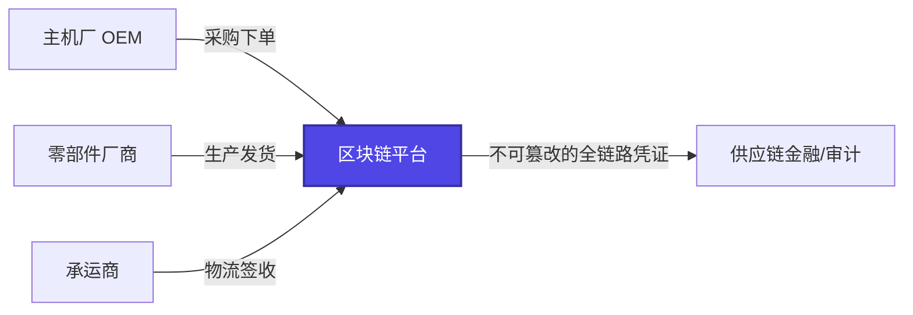
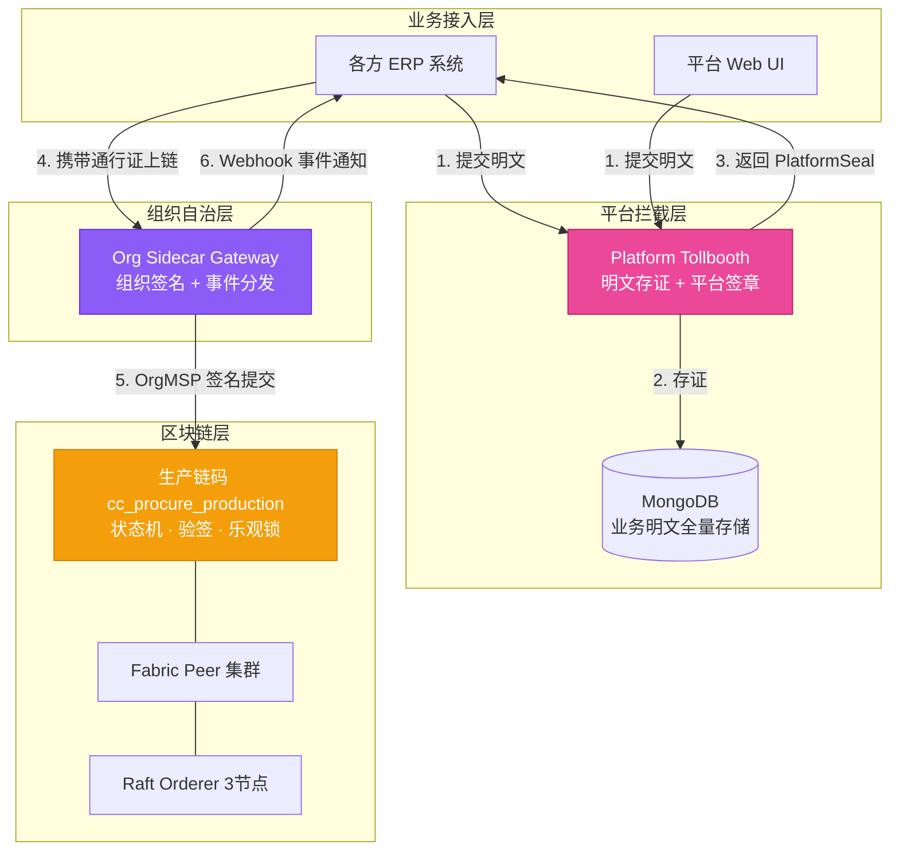
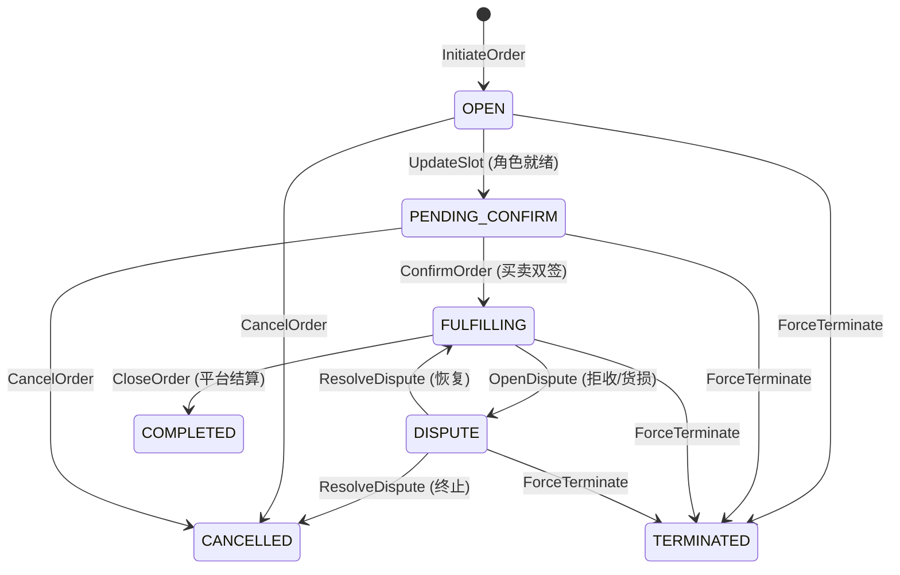

# 汽配供应链区块链平台 — 项目整体汇报

**项目代号**: Fabric-Realty (Aventura)
**汇报日期**: 2026-03-11
**技术底座**: Hyperledger Fabric 2.5.10 · Go 1.23
**代码规模**: 11,600+ 行 Go 核心代码 · 127 运维脚本 · 524 项目文件 · 284 次 Git 提交

---

## 一、项目定位与商业价值

面向汽车零部件供应链的 **生产级联盟链平台**，解决主机厂（OEM）、零部件厂商、承运商之间的 **信任协作** 问题。



### 核心价值

| 维度 | 价值体现 |
|:----:|:---------|
| 🔒 **防伪溯源** | 链上哈希锚定 + ECDSA P-256 数字签名，杜绝数据篡改 |
| 🤝 **多方协作** | 角色插槽机制支持动态组织接入，无需修改底层链码 |
| 📊 **平台价值** | "明文换通行证"架构，平台 100% 截留业务明文数据 |
| 🏦 **金融级安全** | 乐观锁、TTL 熔断、幂等防重、HMAC 鉴权多层防护 |

---

## 二、技术架构全景

### 2.1 系统分层架构



### 2.2 核心架构创新 — "明文换通行证"

> 首创的 **Clearance Token** 物理阻断机制，同时解决两个核心矛盾：
> - ✅ 平台 100% 获得业务明文数据（商业价值）
> - ✅ 各组织用自己的私钥签名上链（去中心化安全）

| 步骤 | 动作 | 载体 |
|:----:|:-----|:-----|
| ① | 业务方提交明文 JSON 到平台 Tollbooth | HTTP API |
| ② | 平台存证明文，ECDSA P-256 签发 PlatformSeal | MongoDB |
| ③ | 业务方携带 PlatformSeal 到自己的 Sidecar 上链 | Fabric SDK |
| ④ | 链码验证 PlatformSeal 密码学合法性，拒绝篡改 | Smart Contract |

---

## 三、已交付成果总览

### 3.1 版本里程碑

````carousel
### v1.0 — 生产级网关（已发布 2026-03-04）

| Phase | 交付内容 | 状态 |
|:-----:|:---------|:----:|
| Phase 1 | 基础架构 & 前置条件 | ✅ 6/6 |
| Phase 2 | 安全体系 & 链码仪表化 | ✅ 6/6 |
| Phase 3 | 同步操作 & 通用路由 | ✅ 2/2 |
| Phase 4 | 异步韧性引擎 | ✅ 5/5 |
| Phase 5 | 生产就绪 & 交付 | ✅ 4/4 |

**小版本**: v1.0.1 OpenAPI 对齐 · v1.0.2 运维验证 · v1.0.3 多组织仿真

<!-- slide -->
### v2.0 — 平台业务公信力建设（进行中）

| Phase | 交付内容 | 状态 |
|:-----:|:---------|:----:|
| Phase 6 | 生产链码 cc_procure_production | ✅ 4/4 |
| Phase 7 | Platform Tollbooth API | ✅ 4/4 |
| Phase 8 | Sidecar 适配（PlatformSeal 透传） | 🔄 计划中 |
| Phase 9 | 联调部署 & E2E 测试 | ⏳ 待启动 |

**总进度: 7/9 Phases 完成 · 31/33 Plans 交付 · 40 项需求中 27 项已实现**
````

### 3.2 核心交付物

| 模块 | 代码量 | 单元测试 | 说明 |
|:----:|:------:|:--------:|:-----|
| **Org Sidecar Gateway** | 5,546 行 | 80 个 | 安全网关：HMAC 鉴权 · 事件分发 · 断路器 · BoltDB 幂等锁 |
| **cc_procure_production** | 1,969 行 | 9 个 | 生产链码：10 个 Action · 状态机 · VerifyPlatformSeal · 乐观锁 |
| **Platform Tollbooth** | 1,826 行 | 9 个 | 明文入口：哈希校验 · Seal 签发 · MongoDB 存证 · 链码提交 |
| **cc_procure_smoke** | 1,114 行 | — | 冒烟测试链码（开发辅助） |
| **运维脚本** | 127 个 | — | 一键部署 · 组织管理 · 环境检查 · 烟雾测试 |

### 3.3 智能合约状态机



**10 个链码动作函数**: InitiateOrder · UpdateSlot · ConfirmOrder · CancelOrder · CreateShipment · TransferCarrier · DeliverShipment · OpenDispute · ResolveDispute · CloseOrder · ForceTerminate

---

## 四、部署架构

### 4.1 网络拓扑

| 组件 | 数量 | 说明 |
|:----:|:----:|:-----|
| Orderer 节点 | 3 | Raft 共识集群，容错能力 |
| Platform Peer | 2 | 治理核心节点 |
| 组织专属 Peer | 按需 | 动态添加，每组织独立 |
| CLI 工具 | 1 | 链码部署与管理 |

### 4.2 三种部署模式

| 模式 | 适用场景 | 特点 |
|:----:|:---------|:-----|
| **Swarm Manager** | 初始化集群 | 部署 Orderer + Platform 核心组件 |
| **Swarm Worker** | 添加组织节点 | 自动加入 Overlay 网络，零配置 DNS |
| **Standalone** | 单机开发/演示 | 一台服务器运行完整网络 |

### 4.3 组织动态管理

```bash
# 一行命令添加新组织
./add-org-remote.sh manufacturer 915200002144305326 192.168.1.37 "贵州轮胎股份有限公司"
```

支持以**统一社会信用代码**为标识的企业动态接入，无需停机、无需修改链码。

---

## 五、安全体系

| 安全层 | 机制 | 说明 |
|:------:|:-----|:-----|
| **传输层** | HMAC-SHA256 请求签名 | 4项 Header 校验（AppId · Timestamp · Nonce · Signature） |
| **防重放** | Nonce 反重放缓存 | 300 秒时间窗口 + 去重检查 |
| **限流** | Token Bucket 令牌桶 | 按 AppId 独立限速 |
| **数据防伪** | SHA-256 哈希校验 | 客户端哈希 ↔ 平台哈希双向比对 |
| **平台背书** | ECDSA P-256 数字签名 | PlatformSeal 密码学证明 |
| **并发控制** | 乐观锁 Version 机制 | 防止惊群覆盖 |
| **僵尸防护** | TTL 自动过期熔断 | ExpiresAt 超时后拒绝任何写入 |
| **幂等防重** | 复合幂等键 | `{actorMsp}:{action}:{clientReqId}` 三维唯一 |

---

## 六、文档体系

| 文档类型 | 核心文件 | 说明 |
|:--------:|:---------|:-----|
| 📐 架构白皮书 | SMART-SUPPLY-CHAIN-ARCHITECTURE.md | 782 行，涵盖数据模型、状态机、安全机制、API 契约 |
| 🏛️ 治理白皮书 | PLATFORM-GOVERNANCE.md | 平台责任边界、争议处理、隐私擦除规范 |
| 🌐 网络拓扑 | NETWORK-Topology-Mapping-v2.0.md | MSP 映射、节点规范、PDC 隐私设计 |
| 🚀 部署指南 | 5 份操作手册 | 快速部署 · Swarm 集群 · 客户端接入 · 环境清理 |
| 📋 需求追踪 | REQUIREMENTS.md | 40 项需求，逐一映射到开发阶段 |
| 🗺️ 路线图 | ROADMAP.md | 9 个 Phase，v1.0-v3.0 版本规划 |

---

## 七、后续规划

### 近期（v2.0 收尾）

| 阶段 | 内容 | 预计工作量 |
|:----:|:-----|:----------:|
| **Phase 8** | Sidecar 适配 — PlatformSeal 透传 + 本地预验证 + EventEnvelope 扩展 | 2 Plans |
| **Phase 9** | 联调部署 — Tollbooth 容器化 + E2E 全链路冒烟测试 | TBD |

### 中期（v3.0 金融级安全底座）

| 方向 | 内容 |
|:----:|:-----|
| 🔐 KMS 集成 | HashiCorp Vault 密钥托管，替代文件系统私钥 |
| 📊 全息监控 | Prometheus + Jaeger + Grafana 端到端可观测性 |
| ⚡ 性能优化 | LevelDB → CouchDB 演进，支持多维复杂查询 |

### 远期（v4.0+ 供应链金融）

| 方向 | 内容 |
|:----:|:-----|
| 🏦 多签互信 | 银行级电子签约 + 链上哈希穿透核验 |
| 🌐 跨链互通 | 多链路由能力预研 |

---

## 八、项目亮点总结

> [!IMPORTANT]
> **三大技术创新**

1. **"明文换通行证" 架构** — 首创 Clearance Token 机制，破解"平台数据垄断 vs 各方私钥自治"的硬矛盾
2. **角色插槽 + 极简动作抽象** — 链码一行不改支撑任意商业模式变阵（直采、撮合、VMI、多段物流）
3. **三层降维数据模型** — PR → PO → Shipment 树状解耦，天然支持一单多商、多段承运

> [!TIP]
> **四大工程优势**

1. ✅ **生产级交付** — 非 POC/Demo，具备完整的安全、容灾、运维能力
2. ✅ **动态组织管理** — 运行时一行命令添加新企业，零停机零改码
3. ✅ **完整工具链** — 127 运维脚本覆盖部署、治理、测试、维护全生命周期
4. ✅ **离线部署** — 支持内网环境一键包部署，适配政企隔离网络

---

*最后更新: 2026-03-11 · 当前版本: v2.0 Phase 7 已完成*
